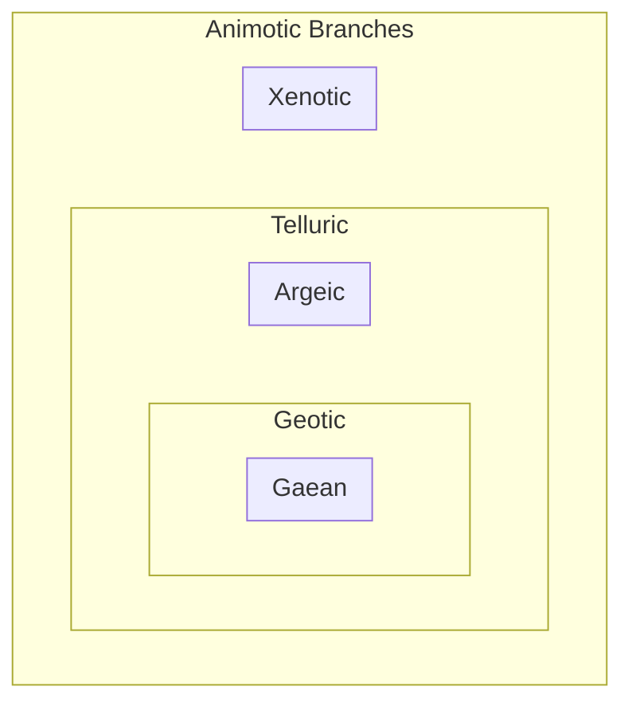

🌱 Animotic Branch (Life-Relevance / Biospheric)
Focus: **How the planemon relates to life (esp. Earthlike envelopes)**
- **Class** → Broad livability envelopes
    - Geotic (Earth-normal range)
    - Gaean (Earth-twin slice of Geotic)
    - Argeic (super-Earths with biospheric richness)
    - Xenotic (exotic chemistries / non-carbonic)
- **Type** → Subdivisions of classes
    - Marginal Geotic, Dense Hot Argeic, etc.

- **Somatics** → Global physical conditions
    - Cryostate (frozen) 
    - Hydrostate (temperate hydrosphere)
    - Pyrostate (runaway greenhouse)
    - Pluristate (diverse climates)
    - etc.

- **Climatics** → Finer descriptors of atmospheric/seasonal character 
    - Tempestal (storm-dominated)
    - Zephyral (mild winds, gentle climate)
    - Serenal (stable, calm, serene environment)

